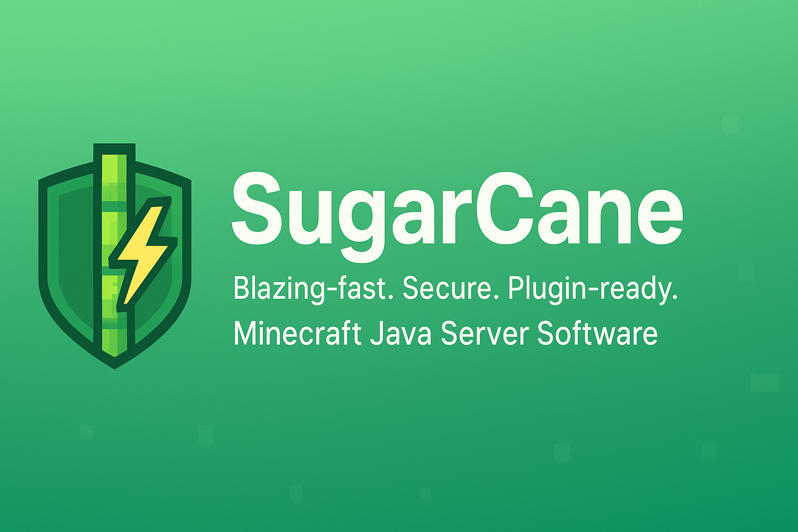

# SugarCane



> **SugarCane** — A blazing-fast, secure Minecraft Java server platform with built-in support for **Paper** and **Spigot** plugins, featuring advanced performance optimizations, security enhancements, and cross-platform compatibility.

---

## 📖 About

**SugarCane** is a next-generation **Minecraft Server Software** focused on improving the Minecraft Java ecosystem.  
It combines **performance optimizations**, **security improvements**, and **plugin compatibility** to create a stable, scalable, and modern server foundation.  

Whether you're running a small community or managing a large Minecraft network, SugarCane provides the tools to make your server run smoother, faster, and more reliably.  

---

## ✨ Features

- ⚡ **High Performance**  
  Advanced tick stabilization, memory optimization, chunk loading improvements, and entity processing enhancements for handling large player counts with minimal lag.  

- 🔒 **Enhanced Security**  
  Built-in exploit prevention, packet rate limiting, command filtering, plugin security scanning, and comprehensive protection against malicious behavior.  

- 🔌 **Plugin Compatibility**  
  Full support for the existing **Paper** and **Spigot** `.jar` plugin ecosystems with automatic compatibility checking and optimization suggestions.  

- 🛠 **Custom Enhancements**  
  Enhanced redstone mechanics, improved mob spawning algorithms, advanced weather systems, and comprehensive player statistics tracking.  

- 🌍 **Cross-Platform Support**  
  Integrated **GeyserMC** and **Floodgate** support for seamless Bedrock Edition player connectivity with optimized protocol handling.

- 📊 **Advanced Monitoring**  
  Real-time performance metrics, security monitoring, plugin compatibility tracking, and comprehensive server statistics.

---

## 🚀 Performance Optimizations

SugarCane includes several cutting-edge performance improvements:

### Tick Stabilization
- Dynamic tick rate adjustment based on server load
- Lag compensation mechanisms
- Non-critical operation skipping during high load
- Target TPS maintenance with configurable thresholds

### Memory Management
- Aggressive garbage collection optimizations
- Object pooling for frequently used objects
- Memory-mapped file optimizations
- Compressed inactive chunk storage

### Entity & Chunk Optimization
- Predictive chunk loading based on player movement
- Entity culling for distant entities
- Optimized mob AI processing
- Configurable processing limits per tick

---

## 🛡️ Security Features

SugarCane provides comprehensive security enhancements:

- **Exploit Prevention**: Protection against known server exploits and vulnerabilities
- **Rate Limiting**: Configurable packet and command rate limits per player
- **Plugin Security**: Automatic scanning and validation of plugin safety
- **Anti-Cheat Integration**: Built-in hooks for popular anti-cheat plugins
- **Malicious Behavior Detection**: Real-time monitoring and blocking of suspicious activities

---

## 🔌 Plugin Support

SugarCane supports:

✅ **Paper plugins** - Full compatibility with optimizations

✅ **Spigot plugins** - Complete support with compatibility layer

✅ **Bukkit plugins** - Legacy support with automatic compatibility checking

✅ **Cross-Platform plugins** - Enhanced support for Geyser/Floodgate plugins

Simply drop your plugin .jar files into the `/plugins` folder and restart the server. SugarCane will automatically:
- Check plugin compatibility
- Apply optimizations where possible
- Report any compatibility issues
- Provide suggestions for improvements

---

## 🌐 Cross-Platform Features

SugarCane includes built-in support for:

- **GeyserMC Integration**: Seamless Bedrock Edition player support
- **Floodgate Authentication**: Cross-platform player authentication
- **Protocol Optimizations**: Enhanced performance for cross-platform gameplay
- **Inventory Synchronization**: Improved compatibility between Java and Bedrock clients
- **Player Statistics**: Unified tracking across all platforms

---

## ⚙️ Configuration

SugarCane provides extensive configuration options through `sugarcane.yml`:

```yaml
# Performance optimizations
performance:
  tick-optimization:
    enable-tick-stabilization: true
    target-tps: 20.0
    dynamic-tick-rate: true
  
  memory-optimization:
    aggressive-gc: true
    object-pool-size: 64
    compress-inactive-chunks: true

# Security settings
security:
  enable-exploit-prevention: true
  max-packets-per-second: 500
  enable-plugin-scanning: true

# Cross-platform support
cross-platform:
  enable-geyser-integration: true
  enable-floodgate-integration: true
  bedrock-player-prefix: "§7[BE]§r "
```

---

## 📊 Commands

SugarCane provides several administrative commands:

- `/sugarcane help` - Show available commands
- `/sugarcane stats` - Display server performance statistics
- `/sugarcane performance` - Show detailed performance information
- `/sugarcane security` - View security status and statistics
- `/sugarcane plugins` - Show plugin compatibility information
- `/sugarcane reload` - Reload SugarCane configuration

---

## 🛡 Roadmap

✅ Advanced performance profiling tools

✅ Enhanced security and exploit prevention

✅ Cross-platform support improvements

✅ Plugin compatibility management

🔄 Expanded API for developers

🔄 Additional gameplay customization options

🔄 Advanced monitoring and analytics dashboard

---

## 🚀 Getting Started

1. **Download the latest build** from the [Releases](https://github.com/AgentH14/SugarCane/releases) page.  
2. Place the `SugarCane.jar` file in a new folder for your server.  
3. Run the server with:  

   ```bash
   java -Xms2G -Xmx4G -jar SugarCane.jar nogui
   ```

4. **Configure** your server by editing `sugarcane.yml` to customize performance and security settings.
5. **Install plugins** by placing them in the `/plugins` folder.
6. **Monitor** your server using `/sugarcane stats` and other administrative commands.

---

## 🤝 Contributing

We welcome contributions to SugarCane! Please see our [Contributing Guidelines](CONTRIBUTING.md) for more information.

---

## 📄 License

SugarCane is licensed under the [MIT License](LICENSE).

---

## 🔗 Links

- [GitHub Repository](https://github.com/AgentH14/SugarCane)
- [Issue Tracker](https://github.com/AgentH14/SugarCane/issues)
- [Discord Community](https://discord.gg/sugarcane)
- [Documentation](https://docs.sugarcane.dev)
